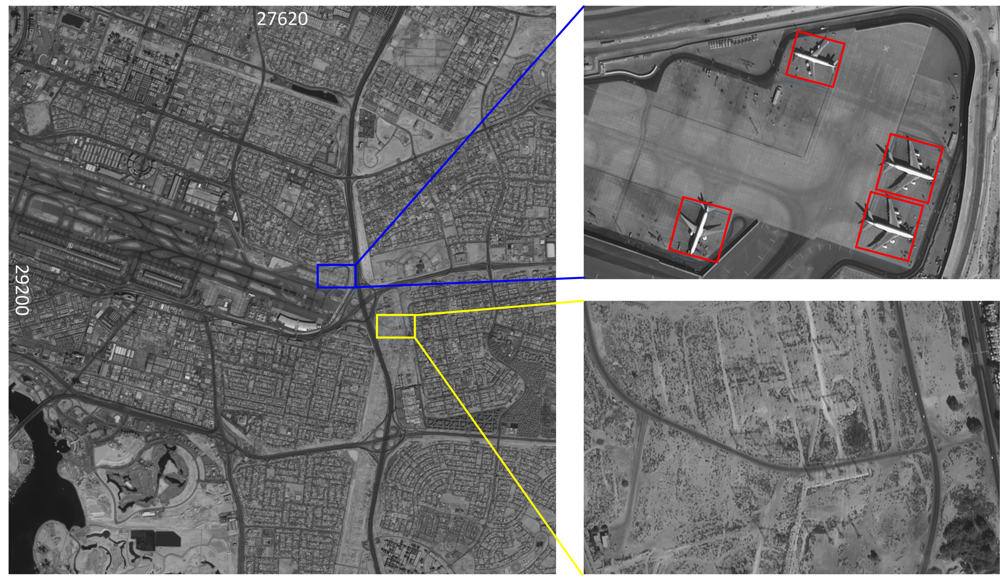

# OAN
This is the official implement of [OAN](configs/obb/oan).

Here we show the inference speed comparison between existing methods
and ours on DOTA-v1.0 test set.


# Fewer is More: Efficient Object Detection in Large Aerial Images

## Introduction
Current mainstream object detection methods for large aerial images usually divide large images into patches and then exhaustivity detect the objects of interest on all patches, no matter whether there exist objects or not. This paradigm, although effective, is inefficient because the detectors have to go through all patches, severely hindering the inference speed. This paper presents an Objectness Activation Network (OAN) to help detectors focus on fewer patches but achieve more efficient inference and more accurate results, enabling a simple and effective solution to object detection in large images. In brief, OAN is a light fully-convolutional network for judging whether each patch contains objects or not, which can be easily integrated into many object detectors and jointly trained with them end-to-end. We extensively evaluate our OAN with five advanced detectors. Using OAN, all five detectors acquire more than 30.0% speed-up on three large-scale aerial image datasets, meanwhile with consistent accuracy improvements. On extremely large Gaofen-2 images (29200×27620 pixels), our OAN improves the detection speed by 70.5%. Moreover, we extend our OAN to driving-scene object detection and 4K video object detection, boosting the detection speed by 112.1% and 75.0%, respectively, without sacrificing the accuracy.

## Acknowledgement
Our OAN is implemented based on the [MMdetection](https://github.com/open-mmlab/mmdetection)

## Installation

### Requirements

- Linux or macOS (Windows is not currently officially supported)
- Python 3.6+
- PyTorch 1.6+
- CUDA 10.1+
- GCC 5+
- [mmcv 0.62](https://github.com/open-mmlab/mmcv)

### Install environment
a. Create a conda virtual environment and activate it.

```shell
conda create -n OAN python=3.7 -y
conda activate OAN
```

b. Install PyTorch and torchvision following the [official instructions](https://pytorch.org/), e.g.,

```shell
conda install pytorch torchvision -c pytorch
```

Note: Make sure that your compilation CUDA version and runtime CUDA version match.
You can check the supported CUDA version for precompiled packages on the [PyTorch website](https://pytorch.org/).

We install the mmdetction with CUDA 10.1 and pytorch 1.6.0. We recommand you using the same vision.

### Install BboxToolkit
```shell
cd BboxToolkit
pip install -v -e .  # or "python setup.py develop"
```

### Install mmdetection
a. Install mmcv
```shell
pip install mmcv==0.6.2
```

b. Install build requirements and then install mmdetection.
(We install our forked version of pycocotools via the github repo instead of pypi
for better compatibility with our repo.)

```shell
# back to mmdetection dir
pip install -r requirements/build.txt
pip install mmpycocotools
pip install pillow==6.2.2
pip install -v -e .  # or "python setup.py develop"
```

If you build mmdetection on macOS, replace the last command with

```
CC=clang CXX=clang++ CFLAGS='-stdlib=libc++' pip install -e .
```


## Usage
The expriments are conducted on four datasets (DOTA1.0, DOTA1.5, DOTA2.0, extremely large Gaofen-2 images(selected from DOTA2.0)). So we take the DOTA dataset for example to introduce the training and testing procedure.

Here we show an example of large aerial images.



### Splitting images (for DOTA)
The DOTA images are too big to train. We need to split the image before training.
```shell
cd BboxToolkit/tools
# Change the path of split_configs/xxxx.json
# add img_dir, ann_dir, and save_dir in xxx.json
python img_split.py --base_json split_configs/xxxx.json
```
The structure of splitted dataset is:
```
save_dir
├── images
│   ├──0001_0001.png
│   ├──0001_0002.png
│   ...
│   └──xxxx_xxxx.png
│
└── annfiles
    ├── split_config.json
    ├── patch_annfile.pkl
    └── ori_annfile.pkl

```
Where, we can reimplement the same splitting by `split_config.json`, the `patch_annfile.pkl` is the annotations after splitting, and `'ori_annfile.pkl` is the annotations before splitting.

Only need to add save_dir path in `configs/_base_/datasets/dota_*.py` to train and test the model.

## Testing

**Start testing**
```shell
# single-gpu testing
python tools/test.py ${CONFIG_FILE} ${CHECKPOINT_FILE} [optional arguments]

# multi-gpu testing
./tools/dist_test.sh ${CONFIG_FILE} ${CHECKPOINT_FILE} ${GPU_NUM} [optional arguments]
```

**Use Oriented R-CNN with OAN as an Example:**
```shell
python tools/test.py configs/oan/faster_rcnn_orpn_r50_fpn_1x_dota10_ss_oan.py model.pth --format-only --options save_dir=dota_submission_dir
```
We add the DOTA merging function in this project. The DOTA submission can directly be generated using `--format-only --options save_dir=submission_dir`


## Training

**\*Important\***: The default learning rate in config files is for 1 GPUs and 2 img/gpu (batch size = 1*2 = 2).
According to the [Linear Scaling Rule](https://arxiv.org/abs/1706.02677), you need to set the learning rate proportional to the batch size if you use different GPUs or images per GPU, e.g., lr=0.01 for 2 GPUs * 2 img/gpu and lr=0.02 for 4 GPUs * 2 img/gpu.

**Change dataset path**
```shell
cd configs/_base_/datasets/
# Change the path of the dota_*.py
# The path of dota_*.py is the dataset after splitting
```

**Start training**

```shell
# single-gpu training
python tools/train.py ${CONFIG_FILE} [optional arguments]

# multi-gpu training
./tools/dist_train.sh ${CONFIG_FILE} ${GPU_NUM} [optional arguments]
```

  
**Use Oriented R-CNN with OAN as an Example:**
```shell
python tools/train.py configs/oan/faster_rcnn_orpn_r50_fpn_1x_dota10_ss_oan.py --work-dir path/to/your/work_dir
```

## License

This project is released under the [Apache 2.0 license](LICENSE).

